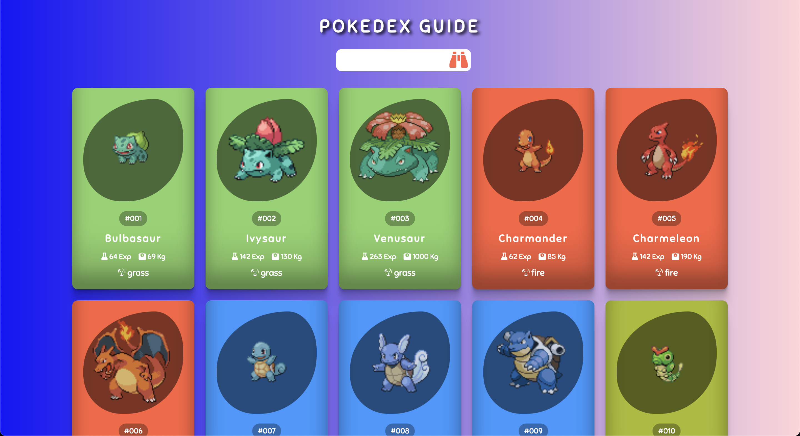

# Pokémon Listing App

This simple JavaScript app lists 151 Pokemon, allowing users to filter Pokemon by name. It utilizes the [PokeAPI](https://pokeapi.co/) to fetch Pokemon data and provides a responsive, user-friendly interface.

## Screenshots




## Features

- **Pokemon List**: Displays 151 Pokemon with type-specific background colors.
- **Search Functionality**: Filters Pokémon by name in real-time.
- **Responsive Design**: Adjusts for various screen sizes.
- **Type-Based Styling**: Each Pokemon card is styled based on its primary type.

## Technologies

- **HTML/CSS/JavaScript**
- **PokeAPI**: Fetch Pokemon data
- **FontAwesome**: For icons
- **JSON Server**: (Optional) for local testing if needed

## How to Use

1. **Clone the Repository**:
   ```bash
   git clone https://github.com/ozerbaykal/pokemon_guide.git
   ```
2. **Run the App**: Open `index.html` in a browser.

## Project Structure

- **poke_container**: Displays Pokemon cards.
- **search**: Filters Pokemon list by name.
- **bg_color**: Provides background colors based on Pokemon types.
